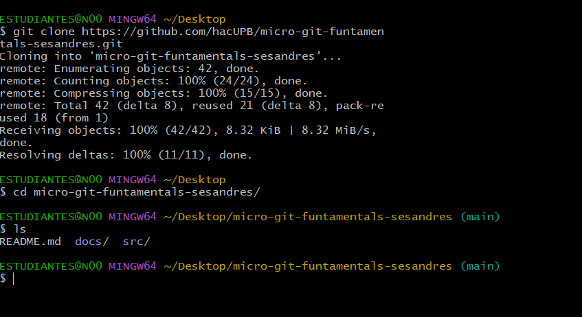

[](https://classroom.github.com/a/_svqiCDi)
# Evaluacion 1
Nombre del estudiante:  Moises Andres Perez Tamayo  
Id.: 000493583

Microprocesadores  
2025

En este proyecto se presenta el repositorio pedido para la evaluacion 1 de microprocesadores, en donde se pusieron a prueba los conocimientos adquiridos durante las 2 primeras semanas del curso.

### Como clonar un repositorio de github

Para clonar un repositorio ya creado en github se tiene que buscar una ubicacion dentro del dispositivo local y abir el git bash en esa ubicacion.  
Luego se usa el siguiente comando para poder clonar el repositorio.

```
git clone "url del repositorio"
```
A continuacion se muestra un ejemplo dentro de git bash.



una vez hecho esto tendremos en nuestro dispositivo local el repositorio de github y ya podremos empezar a trabajar sobre el.

### Enlace directo a archivos Markdown de carpeta docs

| DOCUMENTO | ENLACE |
|--------------|--------------|
| Preliminares | [uso_consola.md](./docs/uso_consola.md) |
| Como crear un repositorio local | [repositorio_local.md](./docs/repositorio_local.md) |
| Como crear un repositorio remoto | [repositorio_remoto.md](./docs/repositorio_remoto.md) |


