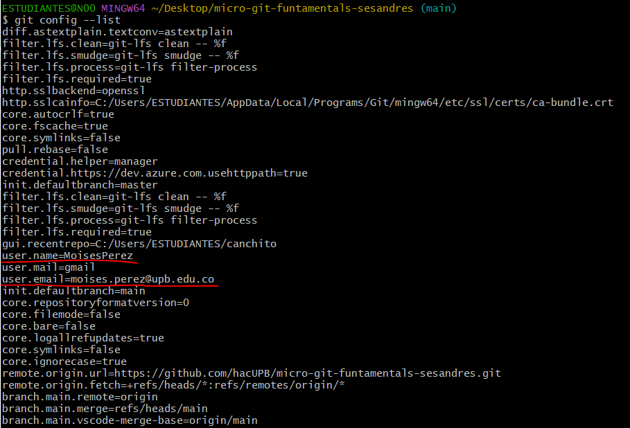

## Como crear un repositorio local

Antes de empezar a usar git es necesario hacer hacer una configuracion para que en cada commit realizado quede guardada informacion de la persona encargada de modificar el repositorio.  
Por lo que se tienen que ejecutar los siguientes comandos para configurar tanto nombre de usuario como correo electronico.
```
git config --global user.name "Tu Nombre"
git config --global user.email "tu.email@ejemplo.com"
```
Y para verificar que esta configuracion se halla guardado correctamente se ejecuta el siguiente comando.
```
git config --list
```
Y se verifica.



### Crear repositorio local
Ahora para la creacion de un repositorio local crearemos un directorio.
```
mkdir mi_proyecto
```
Entramos en el directorio.
```
cd mi_proyecto
```
Y lo iniciamos.
```
git init
```
Y asi finalmente tendremos nuestro repositorio local creado correctamente.
  
En el siguiente link encontrara informacion mas detallada y otros comandos para el uso dentro del repositorio local.

[Creacion y configuracion de repositorio local](https://confusion-snapper-025.notion.site/Parte-1-Git-Repositorio-Local-183e8161b2a1815d88f2ebe974b7ad84)