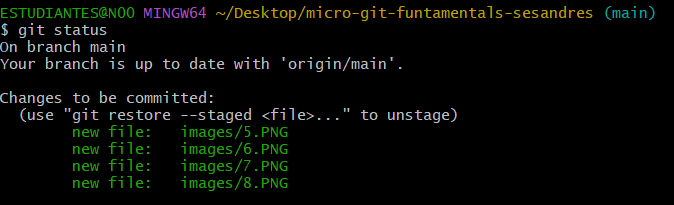

## Como crear un repositorio remoto
Para la creacion del repositorio remoto se usara la plataforma github la cual nos permitira subir nuestros repositorios locales y desde ahi poder compartirlos y almacenarlos.  
Para empezar tendremos que crear una cuenta e instalar la aplicacion de github.  
Ahora se usara el siguiente comando para autorizar el acceso de nuestro computador con tu cuenta de github.
```
gh auth login
```
Posterior a esto ingresaremos en nuestro navegador web a github y crearemos un repositorio.


No modificaremos nada y le damos directamente en create repository


Ahora ejecutaremos el siguiente comando en git bash para vincular el repositorio creado en github con nuestro computador
```
git remote add origin https://github.com/sesandres/ejemplo_micropMoises.git
```
Este ultima URL la encontraremos en el siguiente apartado.


Ahora podemos empezar a trabajar en nuestro repositorio desde git bash.

### Como subir los cambios realizados a nuestro repositorio remoto
Para subir los cambios realizados desde git bash a nuestro repositorio en github, primero verificaremos el estado del repositorio.
```
git status
```
Y si hemos realizado alguna modificacion nos deberia salir un mensaje como el siguiente.


Ahora usamos el siguiente comando para agregar los archivos que queramos que se actualicen en el siguiente commit.
```
git add nombre_del_archivo
```
Verificamos nuevamente que el estado y si agregamos bien los archivos nos deberian salir en color verde como en la siguiente imagen.



Una vez verifiquemos el estado estamos listos para crear un commit, para ello usamos el siguiente comando.
```
git commit -m "Descripcion del commit"
```
Finalmente para subir la actualizacion a nuestro repositorio remoto en github usamos el siguiente comando.
```
git push 
```
Y automaticamente tendremos nuestro repositorio actualizado.  

En el siguiente link encontrara informacion mas detallada y otros comandos para el uso dentro del repositorio remoto.

[Creacion y configuracion de repositorio remoto](https://confusion-snapper-025.notion.site/Parte-2-GitHub-Repositorio-Remoto-183e8161b2a1814c8e0ec82cc7d0e221)